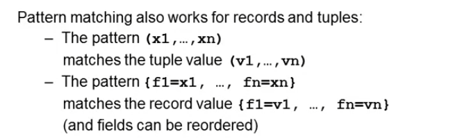
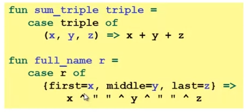
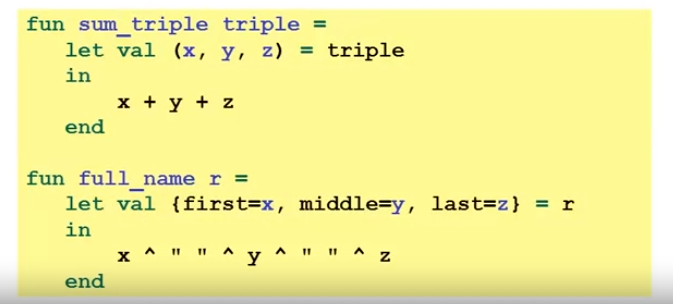
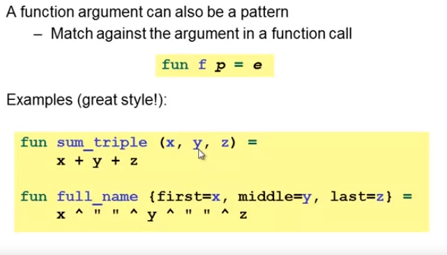
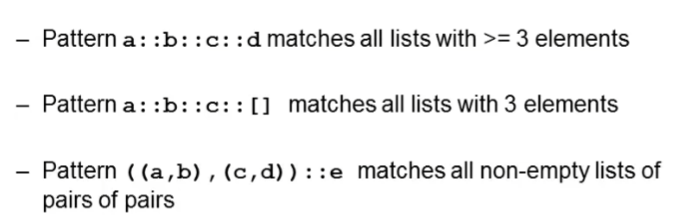
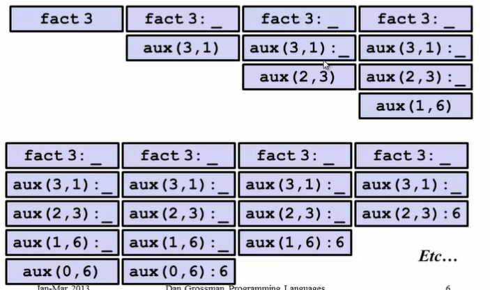
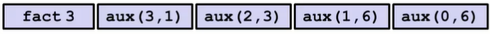
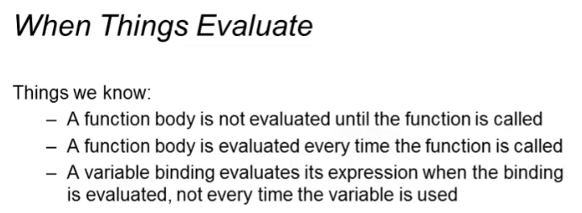

# SCIP课程笔记

## W2

### 程序的本质

1. Syntax: a sequence of digits表达式的语法
2. Type-checking: type int in any static environment运行前val类型的检查
3. Evaluation: to itself in any dynamic environment运行并在动态环境中记录其值

### 表达式的定义

1. 必须是递归的,如同加法是由更小的表达式组成,表达式也是由子表达式定义的。
2. 定义表达式时要注意

   * 该表达式的Syntax语法是否对？
   * Type-checking表达式中的类型以及无法检查类型时如何输出错误提示？
   type-check检查(在使用表达式时进行类型检查),成功->对表达式进行类型检查,没过fail->输出错误提示然后终止。即在静态环境中寻找这个表达式的类型,找到了就输出,没找到就报错。
   * typecheck后在动态环境中寻找表达式的值(此处以val为例)然后使用这个值(这个值是必然存在的因为经过了静态检查,这个表达式必然存在)
   * 例如:val a=10;首先检查val的语法,再检查其类型,a->int,再进行赋值a->10
     * 关于这个binding的问题
       * val的语法？后续是一个值
       * 如何检查a的类型？它这个时候就在静态环境中了吗？在静态环境中,程序会检查binding的值的类型,因为10是一个int,所以在静态环境中a->int
       * 动态环境中什么时候有的10:执行完语句之后动态环境中有a->10,因为binding的时候给了一个10,这个句子经过了语法和type检查后就会把这个值赋给a

3. 例子加法为例
语法:表达式+表达式;子表达式e1和e2typecheck过(成功),且输出其类型是int,则这个加法表达式的typecheck通过并输出int;v1+v2的值(类型检查后其和也是int)
4. 表达式与值的关系:估值(Evaluation)的结果就是值。每个值都是表达式但不是每个表达式都是值【这里是因为不是每个表达式都有估值结果,存在未通过typecheck的表达式,引出一个思考是:词语的语义和逻辑,例如42本身即代表了42这个字,也代表了42这个值】

   * 有一些会自行估值其值的表达式(42 evaluates to 42,true evaluates to true)
   * 每个类型都有其特定的值,当使用某种类型的表达式时,这个表达式估值得到的答案就是这些特定的值
   * 以32为例,语法是一串数字;类型检查它的类型是int;估值(求值规则)是产生其自身。

5. 复杂的例子:if e1 then e2 else e3
   1. Syntax: if e1 then e2 else e3;if,then,else是语法关键词(keywords);e1,e2,e3是子表达式
   2. Type-checking: e1:bool;e2 and e3:t(any type but same)且整个表达式类型是是t
   3. Evaluation: e1->v1(因为经过了类型检查所以v1是true或者false);if true:估值e2并作为整个表达式的结果;if else:估值e3并将v3作为整个表达式的结果。
6. less than
   1. Syntax: e1< e2("<"是一个逻辑运算符)
   2. Type-checking: e1 and e2:t(any type but same:数字型)且整个表达式类型(过了的话)是bool
   3. Evaluation: e1->v1和e2->v2(因为经过了类型检查所以e1和e2必然有v1和v2),如果v1< v2输出true不然flase

### REPL和错误

1. REPL:Read-Eval-Print-Loop 程序本身就是一个REPL,use语句可以更方便的使用它

* 当运行程序的时候(打开rapple输入use)发生读取-估值(如果载估值之前没有类型检查会输出错误信息)-打印结果-循环(返回提示以继续)
* 表达式的开始是以val这类开始的,如果没有键入val就开始下一行,`val x=10;y=x+1`是存在这个类型的语法的,但是可能会解析成`val x = 34 (y=x) +1`此时(y=x)输出一个bool值,而34被认为是一个函数,但是34并不是一个函数,在类型检查中34没有通过其'fun'的类型,因此报错为"operator is not a function [overload conflict]"
* 负数要用~(负号是语法错误);整数除法不能用/要用div(类型检查错误)
  
### Shadowing

1. Shadowing是指将变量添加到环境中时,在添加之前,该变量已在环境中。
2. 例子:val a=5;val a=10;此时a=5这个是无法改变的,我们获得是是一个遮罩值10,此时的a->10,当使用val a=a+1;此时a->11遮住了之前的10。在输出的时候,5和10的语句都会被显示为hidden-value,只有最后的a有值

   ```sml
   val a = < hidden-value > : int
   val b = 9 : int
   val a = < hidden-value > : int
   val a = 6 : int
   val it = () : unit)

   ```

3. 最好不要重复赋值,因为动态环境的值除非重启不然一直存在

### function

1. 语法:fun fun_name(arguments:int,y:int)=
            ...expression...
2. 除非只有一个参数不然要加括号,会自动返回得出的结果不用加return。

   * 在输出函数中,`val pow = fn : int * int -> int`里的*不是乘法,它只是分隔多个参数的类型。这里是指两个int输入pow会输出一个int

3. 函数定义的三部曲

   * Syntax:只检查fun的命名
   * Typing Checking:检查输入的参数和输出的参数的类型是否正确以此获得函数的整体类型,然后将函数加入静态环境中(注意A fun is a value(no evaluation)注意函数中的参数名是不会加入静态环境的,就和其他的编程语言一样。
   * Evaluation:把函数名加入动态环境以便后续可以对其进行调用

4. 函数调用的三部曲 e0(e1,...,en)

   * Syntax:首先在动态环境中检查函数名e0以获得函数本体,然后剩下的参数会作为函数的输入参数。参数的语法就是要用逗号分隔。*不检查参数的个数是否正确。
   * Type Checking:检查e0是否有类型(即左边是参数类型右边是函数的输出类型);检查e1,e2...参数的类型是否和e0左边的参数类型一一对应。最后检查fun call的结果的类型是不是e0的类型。
   * Evaluation:实际上有三个步骤。首先,计算e0以确定要调用的函数。查找e0对应的函数,在动态环境(静态环境里面是函数的类型,*int*int->int)中找到函数的正确绑定。然后计算所有的参数对应的值,最后计算函数fun body来输出最后的值(最后的结果的类型检查在上一步已经做了)

### Pairs and Other Tuples——smaller pieces of data

1. 整合数据的类型——tuples:数目固定,数据类型可以不同;list:数目不定,数据类型相同
2. pairs:包含两个部分

* bulid pairs
  * syntax:(e1,e2)两个逗号分隔的表达式
  * typing checking:e1->ta,e2->tb,(e1,e2)->(ta*tb)星号是分隔符
  * evaluation:e1->value1,e2->v2,(v1,v2)->value
* access the pieces of pairs:
  * syntax: #1e,#2e代表访问求出的e的第一个第二个部分
  * typing checking:(e1,e2)->(type a*type b)则e1->ta,e2->tb,
  * evaluation:返回syntax对应的值
* pairs=two tuples,创建n元tuples=(e1,e2,e3...en),tuples可以嵌套进任何数据结构中
  * val x=(7,(ture,9))->int*(bool*int);val x2=#1 (#2 x1)->bool

### List

1. 不同于元组,list可以指定数目,但是需要类型相同
2. value:空list[]这本身就是一个值,因此求值规则很简单,就是其自身。一个列表也是一个value,这意味着我们可以将列表作为value绑定到variable上(val x=[3,4])
3. list的构建方法

   * 定义法:val x=[1,2,3]->int list
   * CONS方法:e1::e2(e1:value,e2:list) 即 5::x->[5,1,2,3]->int list
     * [5]:: [1,2]不行,因为int list不能容纳int list
     * [5]:: [[6],[7]]->[[5],[6],[7]]->int list list
     * 类型检查:e1::e2(e1->t,e2->t list)

4. list的调用方法

   * null e->e==[](null这是一个函数,它将列表作为参数,如果列表为空则返回true,否则返回false)
   * hd e和tl e返回列表的第一个元素和除第一个元素以外的所有元素
   * val x=[9];tl x->[]:`a list(一个元素的list的tl会返回空list,同时如果我对空列表使用hd,虽然可以通过类型检查但是会报错)

5. 列表的类型

   * [(1,2),(3,4)]->(int*int) list
   * [([1,2],2),([1,2],4)]->(int list*int) list

6. 空列表的类型

   * val x=[]->`a list:这个alpha(‘a)意味着可以用任何类型替代他

7. 创建和使用列表的函数类型

   * null:'a list->bool
   * hd:'a list->'a
   * tl:'a list->'a list

8. 利用递归可以实现很多list的操作,例如乘法和求和等等

### Let Expressions

在函数内部定义变量

1. 三问题

   * syntax:let b1,b2...bn in e end(b1,b2...是绑定,就类似val a;e是let表达式的主体)
   * typing checking:检查b的类型然后加入【内部】静态环境中,主体e的结果将是整个let表达式的结果。这些绑定对任何环境都没有影响,除了在这个let表达式中。将允许在检查主体的类型时使用所有这些绑定,然后主体e的类型将是整个let表达式的类型。在let中可以使用此前环境【外环境】中所有的绑定。
   * evaluation:根据let-in之间的绑定值计算整个in-end之间的e的值

2. let-in-end可以用在任何可以插入表达式的地方

   * 注意,在let中如果有shadow(覆盖)外部值,这个shadow的值是只保留在当前let的内部环境中的。let中的绑定和计算只影响它内部环境中的绑定,并返回整个e的值
   * 此前只能使用在整个程序的顶端绑定的值,在let中又可以拥有let中绑定的值,且只在当前let中使用它。

3. let与内部函数(local function局部函数=nested function嵌套函数)

   * let-in中间可以放入函数的定义,因为函数也是一个绑定,在这里定义的函数可以在in-end部分使用,这就是利用let在函数内部建立的函数。这可以使得在let-in中定义的函数是private的。
   * let-in中可以使用let之前的变量,这个变量在let之前就存在环境中,因此在let内部可以调用这个外部环境中的绑定
   * f2中定义的f1函数的scope:只能在let表达式的后续绑定和let表达式的主体(“in”部分)中使用局部函数。
   * 注意嵌套函数的使用范围,以及是否适用。

### Let Efficiency

1. 递归法求极值在列表很大时,会消耗很长的时间,这是因为它要遍历每一个列表的值。
已知当极大值在列表尾端会消耗很久的时间,这是因为在这个计算中,会计算每个列表两次,即30个元素的列表会递归计算两次,29的也会,一直到遍历到最后的最大值,由于每一个递归内部都有两次递归计算,因此最后的计算次数实际上是2^n

因此在函数中应当避免重复调用递归,即将结果存储在变量中

2. 代码高效:避免重复计算的递归,这会造成指数级别的算术成本。使用let表达式可以在函数中定义新的函数,解决递归问题。

### Options

option就如同list一样,也是一个类型。建立option的方法类似list。

1. 定义和调用

这里的SOME就类似建立一个仅有一个元素的列表。
`val t = SOME 3 : int option`
`val y = NONE : 'a option`
isSome类似判断列表是否为空,不过这里的情况是如果option为SOME(非空)就返回true。
`val it = true : bool`
valOf如果输入的是NONE会返回异常,否则返回值
`valOf t;->val it = 3 : int`

2. max_option版本

但是let中,`isSome tl_ans`是一个重复的判断,因为只有在进行到列表的最后的时候,tl返回的才是空列表,此时的tl_ans才会是NONE,即这个判断大多数时候做出的都是SOME,并且在最后一次为NONE的时候会将这个结果层层返回 递归中。即在空列表上会进行递归调用(假设此时递归进行到尾端,此时的max1(tl xs)是max1(NONE),这就导致空的列表还会进行一次递归,这可能会引发异常)

max2只用非空的xs来进行递归调用,避免了空列表递归

3. option与list差异
定义类似,判定函数不同,且option仅有NONE或仅包含一个元素的SOME

### Booleans and Comparison Operations

1. Booleans Operations`e1 andalso e2`和`e1 orelse e2`和`not e1`
Type-checking:e1:bool,e2:bool
Evaluation:与运算,或运算,否运算
【注意】andalso和orelse只是关键字而不是函数,not是函数,因为在调用函数前就会对函数进行评估。而andalso和orelse并不会,当仅仅输入andalso和orelse时会报错,需要关键词,而输入not,会报告其函数类型
2. Comparison Operations=六个比较符号`< > >= <= = <>`
`< > >= <=`可以用于int *int或real* real(real就是float)但是不可以用于int * real
`= <>`不可以用于real,浮点数总是有微小的不同,<>是反等号(!=)

### Benefits of No Mutation

关于原地修改:函数式编程的特点是无法原地修改


* 如果y和x指向的同一个pair,那么y称为x的别名aliases
* y指向另一个pair,不是x的别名
* 那么对x做出修改后,y是别名还是copy决定了y是否有变化
在ML中,没有mutation,因此同变量都是别名,不是复制值只是返回了值的别名。在有突变的语言中分辨别名和copy是很难的,ML避免了这一点(不会因为改变了其中一个别名的值导致所有的别名都变化,因为不能mutation)。

### Pieces of a Language


1. 语法:语言的结构,使用的语法结构
2. 语义:评估(计算值)的规则,程序的意义
3. Idioms:编程习惯用法是用特定语言编写任务的常用方法,知道语法更要知道用法,比如let-in的idiom use就是使之是内部的
4. Libraries:库,可以自己定义也可以调用
5. Tool:语言的工具,而非语言的一部分,例如REPL,debug

Focus on semantics and idioms.

## W3

### Building Compound Types

1. Base type and Compound type
   * base:int,bool...
   * compound:build new types with other types inside of them=list,tuple...
2. Build Compound fun
   * each of(包含t1,t2,t3,比如物体的位置(int\*int\*int)),one of(包含t1,t2,t3的某个值,例如某个饼干的味道,某一天的天气),self reference(递归调用)
   * each of:tuple(int*bool)包含“所有”的值
   * one of:option(要么SOME要么NONE)
   * list:三者都有,list可以是包含int和一个int list(这是自我调用的全包含),也可以什么都没有(这是仅包含其一)
   * 一个例子:((int \* int) option \* (int list list)) option,其中(int list list)can be described in terms of each of, one of and self reference.

### Records——build each of type(another one called tuple)

1. field name:该类型中包含的field的名字,field则对应某个表达值,定义时无需声明field类型,会自动根据表达式计算
2. record的输出会计算每个表达式的结果并返回一个按字母排序后的record,且整个record的类型由{}包裹并显示每个field的类型
3. exp:`val X = {idx=1,name="adam"};`,输出`val X = {idx=1,name="adam"} : {idx:int, name:string}`
4. 调用:`#idx X`
5. 与tuple的区别:tuple短且由定位,record便于分辨和记忆。但在有的编程语言中会混用,比如调用者caller用position调用而被调用者用name调用
   * Tuple as syntactic sugar
   * tuple是record的另一种表达形式,当filed name是连续的int时,record表现为tuple(Tuple's just another way of writing the record with field names one up to n)
   * exp:`val x = {1=1,2="aaa",3=true};`->`val x = (1,"aaa",true) : int * string * bool`

### Datatype Bindings

val binding,fun binding,data type binding

1. datatype绑定的每一个类型相当于一个函数,会将对应的类型转为datatype指定的类型名字
2. 在下列例子中,`val a = Str "hi"`代表着a具有mytype的Str种类(即“tag”,表示构造a的constructors种类),其str值为"hi"(对应的值),整个a的值是:应用于"hi"的mytype中的Str构造函数的返回值,这种包含构造函数的表现形式也成为"tagged unions"-标记联合

3. 构造mytype中的kind时就是made from one of the constructors,其实就是一个小的构造函数
4. Pizza->value,`val a = Pizza : mytype`就类似于`val b = [] : 'a list`都是一个值,不过这个值代表着空值。
5. 关于类型的访问
   * 需要两个方面来访问数据:check variant=检查数据的tag,即其construct;extract data=提取数据的值
   * 例如:check variant->null/isSome;extract data=hd/tl/valOf
6. 关于datatype的辨析
   * datatype的值包含其构造函数及其值
7. list和option也是datatype，NONE/SOME也可以作为case中的pattern，[]和::也可以作为case中的pattern.利用这个可以构建option和list相关的函数

```sml

fun inc_or_zero intoption =
    case intoption of
      NONE => 0
      | SOME i => i+1

fun sum_list xs =
    case xs of
      [] => 0
      | x::xs' => x + sum_list xs'

fun append (xs,ys) =
    case xs of
      [] => ys
      | x::xs' => x :: append(xs',ys)
(* append的分支顺序可以交换，因为case不是顺序执行而是择一执行 *) 
```

case表达式可以有效避免list为空或者option为空产生的错误，应当多用case而非isSome...

### Case Expressions

使用 case 表达式来访问数据类型的各个部分`case x of...`对case的每种不同情况(即mytype中的不同类型)之间用"|"分隔,如果mytype的构造函数具有返回值,需要指定该值的绑定变量名,例如`Str S`就是保存了x是一个str情况下的string值


1. case of
   * 匹配的是箭头左边的pattern,检查哪个分支匹配,这个匹配是从一个构造函数建造的
   * 每个分支都相当于一个小的let,let的val就是这些构造函数名字后面的变量名,比如let TwoInt传入的第一个int作为i1,let s为Str的传入值(这里的str相当于str("hi"),str就是一个构造函数,"hi"是传入的值,也是用s指代的值)
   * case of的数据类型就是每个分支的数据类型
   * case (a,b) of是允许的

2. 匹配的过程pattern match
   * 首先,找到匹配的分支并适当地绑定变量
   * 然后在该分支环境中,评估右侧的表达式
   * 分支中绑定的变量的使用`Str s => String.size s`或`i1+i2`

3. case of的一般表达式

   ```sml
   case e0 of
        p1 ==> e1
        p2 ==> e2
        ...
        pn ==> en
   ```

   * pattern是一个类型,TwoInts(i1,i2)看上去很像一个表达式,但是不是,pattern包括的是constructor名及其变量
   * pattern不会进行评估evaluate,只会在e0匹配了某个pattern后计算其右边的e

4. case of需要注意的
   * case of的分支不可重复,即不能出现两个Str分支(match redundant)
   * case of的分支也不可缺少,不然在调用没有定义分支的pattern时会报错match non exhaustive
   * 不可错分支取值,即在Str分支下试图取TwoInt的int值
   * 非常优雅,比用函数检查类型构造优雅得多

### Useful Datatypes

1. datatype的应用：枚举enumerate(例如纸牌中花色作为suit datatype的pattern),识别identifying

   * 例如在辨识学生成绩时，要么取得学生的ID，要么取得学生的名字。如果选择将学生的成绩，姓，名字和中间名都列入record将是一个糟糕的方式，这是一个each of type，但是我们并不是需要使用全部的值，而只是需要一部分，即one of type。当需要所有的数据，即学生名字和学号时，each of type是一个合理的方式

2. 递归的datatype(注意datatype中construct的名字不代表函数，那只是一个类别的名字。真正的构造函数在调用这个类型的case里面的箭头处)
   * exp的一个例子，相当于一个set tree

   ```sml
   datatype exp = Constant of int 
             | Negate of exp 
             | Add of exp * exp
             | Multiply of exp * exp

   fun eval e =
    case e of
        Constant i => i
      | Negate e2  => ~ (eval e2)
      | Add(e1,e2) => (eval e1) + (eval e2)
      | Multiply(e1,e2) => (eval e1) * (eval e2)

   fun number_of_adds e =
     case e of
        Constant i      => 0
      | Negate e2       => number_of_adds e2
      | Add(e1,e2)      => 1 + number_of_adds e1 + number_of_adds e2
      | Multiply(e1,e2) => number_of_adds e1 + number_of_adds e2

   fun max_constant e =
      let fun max_of_two (e1,e2) =
         let val m1 = max_constant e1
             val m2 = max_constant e2
         in 
            if m1 > m2 then m1 else m2 
         end
      in
         case e of
         Constant i      => i
         | Negate e2       => max_constant e2
         | Add(e1,e2)      => max_of_two(e1,e2)
         | Multiply(e1,e2) => max_of_two(e1,e2)
      end

   fun max_constant2 e =
      case e of
      Constant i      => i
      | Negate e2       => max_constant2 e2
      | Add(e1,e2)      => Int.max(max_constant2 e1, max_constant2 e2)
      | Multiply(e1,e2) => Int.max(max_constant2 e1, max_constant2 e2)

   val example_exp = Add (Constant 19, Negate (Constant 4))

   val example_ans = eval example_exp

   val example_addcount = number_of_adds (Multiply(example_exp,example_exp))
   ```

   * number_of_adds不计算值，是计算在运算中发生多少次加法。
   * 数据类型对于表示许多不同类型的数据很有用。特别是，这些有趣的树状结构，我们可以在上面编写递归函数，以产生答案。
   * 关于`Negate e2       => number_of_adds e2`中e2的作用，是用来存储传入的值，以便pattern对应的表达式进行调用
   * 如果模式匹配的构造函数不包括数据，就类似匹配到一个空的datatype中的construct，因此，在这种情况下，如果它匹配，则没有什么新东西可以添加到环境中，但仍然会转到相应的分支执行评估该表达式
   * max_constant2是为了避免在let中反复计算递归值，而是将递归放置尾部

### Type Synonyms

`type anme = t`Type只是为已经存在的相同类型创建另一个名称，一般不用type去定义数据类型，而是用type对数据类型或者已有的数据类型的组合进行重命名，然后在任何用到这个类型的地方使用type的名字，type的名字和type指向的类型t是可以互换的

```sml
datatype suit = Club | Diamond | Heart | Spade

datatype rank = Jack | Queen | King | Ace | Num of int

type card = suit * rank

type name_record = { student_num : int option, 
                     first       : string, 
                     middle      : string option, 
                     last        : string }

fun is_Queen_of_Spades (c : card) = 
    #1 c = Spade andalso #2 c = Queen

val c1 : card = (Diamond,Ace)
val c2 : suit * rank = (Heart,Ace)
val c3 = (Spade,Ace)
(* 这三种定义方式都是合理的，其类型都是card，在输出的时候可能显示的不同，即card或者suit * rank，但是本质是一样的  *)
```

### Polymorphic Datatypes

1. list和option其实并不是一个type，int list才是，因此list是一个Polymorphic的type constructor，根据不同的数据类型有不同的list。**它们是采用类型参数来生成类型的东西**
   * NONE is not a valid type because it is actually a value of type verb\#'a option\#’a option.
   * int \* int list是对的，list \* list不行，要有具体的list类型
2. 函数可能是多态的也可能不是，例如sum是一个int list->int的函数，但是append函数则取决于其输入list的类型

```sml
datatype 'a option = NONE | SOME of 'a

(* similarly, here are polymorphic lists but without special syntax *)

datatype 'a mylist = Empty | Cons of 'a * 'a mylist

(* a fancier example for binary trees where internal nodes have data of
   any one type and leaves have data of another possibly-different type *)

datatype ('a,'b) tree = Node of 'a * ('a,'b) tree * ('a,'b) tree
                        | Leaf of 'b

(* type is (int,int) tree -> int *)
fun sum_tree tr =
   case tr of
      Leaf i => i
      | Node(i,lft,rgt) => i + sum_tree lft + sum_tree rgt

(* type is ('a,int) tree -> int 多态*)
fun sum_leaves tr =
    case tr of
      Leaf i => i
      | Node(i,lft,rgt) => sum_leaves lft + sum_leaves rgt

(* type is ('a,'b) tree -> int  多态*)
fun num_leaves tr =
    case tr of
      Leaf i => 1
      | Node(i,lft,rgt) => num_leaves lft + num_leaves rgt

datatype ('a,'b) flower =
      Node of ('a,'b) flower * ('a,'b) flower
      | Leaf of 'a
      | Petal of 'b
(* 这是一棵二叉树，内部节点不保存数据，因为 Node 只包含flower，本身没有数据，并且有两种不同类型的叶子（叶子和花瓣），每个叶子都保存不同类型的数据。*)
```

### Each of Pattern Matching / Truth About Functions

1. 之前运用Pattern Matching都是针对one of type的，但是Pattern Matching同样也可以运用于each of type。即在之前的case of中的pattern都是一个单个的pattern，所有用了pattern的地方其实都是可以用tuple pattern

   * 在之前的case of中一般是一个pattern(也就是datatype的每个pattern就是x)都对应的case of的箭头后面的一个值；现在的新的Pattern Matching也可以用在each of上，每个pattern都有自己的filed name，每个filed name又对应着pattern的值。
   * 例如在原来的pattern上用tuple/record pattern代替
   * 上述例子中，case of的pattern中的值在case of右边都是可以调用的
2. `val variable=expression`的真相是`val pattern=expression`，variable是一个特殊的pattern，它匹配(matching)的是expression的整个结果。但是，如果在variable的位置放置不同的pattern，那么它也将与表达式e匹配，并提取各种片段。
   * expression是datatype的构造函数之一时不适用，因为val就像是一个单臂的case of，对于each-of-type这种单臂表达式是合适的因为我们只需要一个分支，但是对于datatype我们需要其所有分支
   * 例如`val NONE = SOME 2;`这里的SOME 2就是option(one of)的pattern SOME构造的表达式，option也是一个datatype，所以我的推测是会报错(It won't compile because of a type error.)
   * 实际上：Bind exception will be raised，但是NONE和SOME 2不匹配，但没有其他模式可供尝试。因此，发生非详尽的绑定失败。
   * 用let in代替单臂case这里用letin代替单臂case，这里的val意味着把triple表达式的值绑定到(x,y,z)这个tuple pattern上，这个时候x,y,z会绑定动态环境中triple的三个对应的部分的值。在full_name函数中，val的pattern是一个record pattern，其右侧的表达式r必须是一个record，且其对应的filed name是val表达式左侧pattern中的filed name，且所有的filed都是string.

3. `fun f v = 'body'->expression`的真相是`fun f p = e`
   * 下列的例子就是用于提取tuple和record的模式匹配
   * 如果fun的输入是一个variable，它将与函数的整个参数进行匹配，但如果它是一个p，将继续提取参数的各个部分。在fun sum_triple中，(x,y,z)会匹配输入的pattern，并将对应的值绑定到x,y,z上；同样的full name函数的输入要和这里的pattern完全匹配才是合法的。
   * 但是这里的sum_triple看上去是一个有三个int输入的函数，而不是有一个triple(pattern)输入的函数——事实上，所有的fun都只接受一个输入pattern，而非我们所看见的多个或者一个参数(只是接受一个参数是元组的函数,这些函数是通过在该元组上使用模式匹配来实现的，也就是用模式匹配获得元组的不同部分，以便可以获得该元组的不同的部分的值。)

### A Little Type Inference

是hw2的一个预先知识

* 在hw2中不应当使用#，这样就不需要为\#做类型的声明，使用模式匹配来获取元组或record的各个部分，类型检查器总是可以弄清楚函数参数的类型应该是什么。因为在定义定义函数的时候他就会根据fun的body部分确定每个输入的参数的类型。
* 如果在函数体中用了\#并且在定义函数的时候没有指明输入的数据的格式(比如int\*int\*int)则类型检查不确定输入是否还会有\#4、\#5，类型检查其会无法确认输入的宽度，因此报错。
* 但是ML也不是完全无法判断输入的类型，如果函数主体中对输入进行了运算(比如乘法加法)那函数会自己判断输入必然是一个int
* 在不使用\#的函数中，如果没有使用所有的输入，那么未被使用的输入的类型就可以是任何类型，因为不管是什么类型这个函数都是可以正常工作的

```SML
(* these functions are polymorphic: type of y can be anything *)

(* int*a'*int->int *)
fun partial_sum (x, y, z) = 
    x + z
    
fun partial_name {first=x, middle=y, last=z} =
    x ^ " " ^ z
```

### Polymorphic and Equality Types

1. 关于多态型的通用性
   * `'a list * 'a list -> 'a list`这种多态类型的‘a可以同时被替换为任何类型，通用性大于t1(eg. `t1:int list * int list -> int list`)但是通用性不如`t2:int list * string list -> int list`因为'a需要统一的替换
2. t1与t2的general比较：t1('a被替换为同一类型)>t2('a被替换为某一类型，'b被替换为相同或不同的类型)
3. 类型通用性的比较:尽量定义比自己需要的类型更加通用的类型

   ```SML
      type foo = int*int
      (* record 1 通用性r1>r2=r3 *)
      {quux:'b, bar:int*'a, baz:'b}
      (* record 2 r2的每个'a和'b都必须被一致地替换例如'a->int,'b->string *)
      {quux:string, bar:foo, baz:string}
      (* record 3  *)
      {bar:int*int, quux:string, baz:string}

   ```

   * 另一种比较`’a * ’b -> int`vs`’a * ’a -> ’a`：无法比较。因为并没有对前者的'a做一致性替换。
     * 如果希望前者更加通用，则需要对前者进行一致性替换来获得后者，但是int的类型无法改变(int的通用型弱于‘a)
     * 如果希望后者更通用，则要对后者进行一致性替换获得前者，即将所有的'a替换为同一类型，这是不可能的。所以无法比较。
   * 通用性：如果能将t1中的类型进行一致性替换后变为t2，则t1>t2

4. Equality Types->`''a list * 'a -> bool`这里的`''a`和`'a`并不一样，`''a`只能被替换为可以用等号操作的type
   * Equality Types：int,string,tuple...
   * No Equality Types:fun type,real(浮点数)...
   * 实例：x,y等式操作则类型必须是Equality Types，而x=3限制了x必须是int，因为等式要求比较的两个事物类型相同

   ```SML
   (* has type ''a * ''a -> string *)
   fun same_thing(x,y) = if x=y then "yes" else "no" 

   (* has type int -> string *)
   fun is_three x = if x=3 then "yes" else "no" 
   ```

### Nested Patterns

1. zipping and unzipping
2. pattern的嵌套:函数的输入是一个pattern但是这个pattern可以是嵌套的pattern
   * zip3的类型：val zip3 = fn : 'a list \*'b list\* 'c list -> ('a \*'b\* 'c) list
   * unzip3的类型：val unzip3 = fn : ('a \*'b\* 'c) list -> 'a list \*'b list\* 'c list
   * ([ ],[ ],[ ])->a pattern for a tupple with three patterns for lists inside of it.

   ```sml

   zip3([1,2,3],[4,5,6],[7,8,9])->val it = [(1,4,7),(2,5,8),(3,6,9)] : (int * int * int) list
   unzip3([(1,4,7),(2,5,8),(3,6,9)])->val it = ([1,2,3],[4,5,6],[7,8,9]) : int list * int list * int list

   (* do this *)
   fun zip3 list_triple =
       case list_triple of 
       ([],[],[]) => []
         | (hd1::tl1,hd2::tl2,hd3::tl3) => (hd1,hd2,hd3)::zip3(tl1,tl2,tl3)
         | _ => raise ListLengthMismatch

   (* and the inverse *)
   fun unzip3 lst =
       case lst of
            [] => ([],[],[])
            | (a,b,c)::tl => let val (l1,l2,l3) = unzip3 tl
                              in
                              (a::l1,b::l2,c::l3)
                              end

   fun nondecreasing xs =
    case xs of
         [] => true
         | x::[] => true
         | head::(neck::rest) => (head <= neck andalso nondecreasing (neck::rest))

   datatype sgn = P | N | Z
   (* 定义类型P代表正数，N代表负数，Z代表0  *)

   fun multsign (x1,x2) = 
      let fun sign x = if x=0 then Z else if x>0 then P else N 
      in
      case (sign x1,sign x2) of
       (Z,_) => Z
        | (_,Z) => Z
        | (P,P) => P
        | (N,N) => P
        | _ => N (* many say bad style; I am okay with it *)
      end

   (* 谨慎使用_代替剩下的case，这可能会导致case在没有覆盖所有的情况下sml不报错（但是代码可能实际上是有错误的）*)

   fun len xs =
    case xs of
       [] => 0
      | _::xs' => 1 + len xs'

   (*当您不需要分支中的相应数据时，通配符(_)会将其简洁地传达给阅读您代码的人。*)
   ```

3. Nested Patterns具有递归的定义
   * p is variable x->v
   * p is _ x->nothing
   * p is (p1,p2...pn)->(v1,v2...vn)
     * 模式匹配中的一个额外规则是，永远不允许多次使用变量。如果尝试在一个模式中多次使用同一变量，编译器将拒绝该变量。
     (*这将只匹配同样是元组的值，其中包含N个值。只有当P1匹配V1，P2匹配V2，以此类推，直到PN匹配VN。同时还需要注意*)
   * p is C p1(constructors C)->C v1(v1必须是由相同的constructors C构建的)
   * 一些嵌套patterns的例子
     * 第一个例子中的::其实就是构造函数的一种，得到的Pattern就是嵌套的p1->a,p2->b...则对于右侧的值，a会匹配第一个值，b匹配第二个...d则匹配第三个之外剩下的，如果list太短->将尝试将空列表构造函数值与cons构造函数模式进行匹配，但是这显然会失败(即`::c::d->[]`c的构造函数是cons::(这个是针对非空列表的构造函数)，但是在少于三个元素的列表中最后一个值是空列表，空列表的构造函数显然与cons不同，则c就不能与空列表的构造函数获得的值去匹配)
     * 第二个例子中如果列表过短，会和第一个例子一样。如果列表过长，那么空列表pattern会匹配一个非空列表的值，这也是无法匹配的
     * 第三个例子中，如果右边是一个空的列表，就和第二个例子中过短的列表一样
4. Function Patterns->case of的简写
   * 常见的fun方式是`fun f p = e`但是也可以写成

   ```SML
   fun f p = e
      |f p2 =e2
      ...
   
   fun eval (Constant i) = i
     | eval (Negate e2) = ~ (eval e2)
     | eval (Add(e1,e2)) = (eval e1) + (eval e2)
     | eval (Multiply(e1,e2)) = (eval e1) * (eval e2)

   fun append ([],ys) = ys
     | append (x::xs',ys) = x :: append(xs',ys)
   ```

### Exceptions

运行时条件应该是错误时使用的异常

1. 如何抛出(raise)异常->定义exn然后raise
   * 定义一个exception(`exception MyOtherException of int * int`)和抛出一个exception(`raise MyOtherException(3,4)`)是不同的

   ```sml
   exception MyUndesirableCondition

   exception MyOtherException of int * int

   raise MyOtherException(3,4)

   fun mydiv (x,y) =
       if y=0
       then raise MyUndesirableCondition
       else x div y 

   (* exn is the type of all exceptions *)
   fun maxlist (xs,ex) = (* int list * exn -> int *)
       case xs of
           [] => raise ex
         | x::[] => x
         | x::xs' => Int.max(x,maxlist(xs',ex))

   val w = maxlist ([3,4,5],MyUndesirableCondition) (* 5 *)
   (* 此时函数输入中的MyUndesirableCondition只是一个异常值，不会引发异常 *)

   ```

2. 如何捕获(handle)异常`e1 handle ex => e2`
   * 如果 E1 评估正常，那么正常evaluate，如果e1抛出异常则evaluate E2.如果 E1 引发的异常不是ex，则继续(不过终端会提示未捕获的异常"uncaught exception MyUndesirableCondition",即正常抛出异常而不是去evaluate E2)。

   ```sml
   val x = maxlist ([3,4,5],MyUndesirableCondition) (* 5 *)
    handle MyUndesirableCondition => 42

   (*val y = maxlist ([],MyUndesirableCondition)*)

   val z = maxlist ([],MyUndesirableCondition) (* 42 *)
    handle MyUndesirableCondition => 42
   ```

### Tail Recursion

  ```sml
  (* Programming Languages, Dan Grossman *)
   (* Section 2: Tail Recursion *)

   fun fact1 n = if n=0 then 1 else n * fact1(n-1)

   fun fact2 n =
      let fun aux(n,acc) = if n=0 then acc else aux(n-1,acc*n)
      in
        aux(n,1)
      end
   (* The result of the recursive call is the result. *)

   fun sum1 xs =
    case xs of
        [] => 0
      | i::xs' => i + sum1 xs'
   (* 非尾递归 *)
   fun sum2 xs =
       let fun f (xs,acc) =
               case xs of
                   [] => acc
                 | i::xs' => f(xs',i+acc)
       in
           f(xs,0)
       end
   (* 尾递归 *)
   
   fun rev1 xs =
      case xs of
          [] => []
        | x::xs' => (rev1 xs') @ [x]
   (* 这里是将x作为一个列表放在结果的尾部，这样做很没有效率 *)
   fun rev2 xs =
       let fun aux(xs,acc) =
               case xs of
                   [] => acc
                 | x::xs' => aux(xs', x::acc)
       in
           aux(xs,[])
       end
   (*  acc有Accumulator的意思  *)
   ```

1. 堆栈
   * 当调用一个函数F时，它所做的是将一些实例推到堆栈上，一些东西将留在堆栈上，直到对F的调用完成，当对F的调用完成时，我们将从堆栈中弹出它。
   * 堆栈包含所有已开始和未完成的调用

2. 尾递归：The result of the recursive call is the result. 当我们进行递归时，在递归调用完成后，调用者就没有更多的工作要做了。
3. 如果堆栈帧所要做的只是从被调用方获取结果并立即返回它，那么根本不需要保留堆栈帧。所以tail call会在调用之前移除调用方的堆栈帧，以便被调用方仅重用调用方使用的相同堆栈空间。即在实际的tail call中，堆栈的空间会被重复利用，即调用的堆栈帧会替代之前调用方占据的堆栈帧。
   * 未替代的堆栈情况
   * 替代的堆栈情况
   * 由于没有额外的计算，实际上不存在堆栈，整个函数的调用共享一份空间(即`fact 3`会被`aux(3,1)`取代)，最后计算出的结果会直接返回而非一层层返回，每一列方框是一个时刻，顺序是从左到右。
4. Accumulators for Tail Recursion尾递归的累加器，普通函数转为尾递归函数的常见方法是：增加一个helper fun，例如上述代码中的`aux`
   * 关于`rev1`为何糟糕：这个附加运算符`@`总是复制第一个列表。这就是append的工作原理。在append版本中，无论append是否为尾部递归，都会发生同样的情况。这导致做了很多多余的运算，当我们有k个递归调用时，其中一个将复制长度为1的列表，一个长度为2的列表，另一个长度是3的列表，一直到长度为k减1的列表中的一个，或者甚至是k。这会很不高效，而尾递归没有做这种复制，它只使用了一个列表，并cons。
5. 并非所有函数都可以写为尾递归形式。对于我们编写的许多程序，更重要的是它们要直截了当、易读，并且易于验证它们是否做了正确的事情。
6. tail call = a fun call in tail position 即在尾递归的位置后没有别的工作了
   * exp:`if e1 then e2 else e3`中的`e2`和`e3`就是tail call
   * `if let b1 ... bn  in e end`的`e`也是tail call
   * 只有表达式`e`之后没有其他的工作要做才是tail call，不然就算在尾部也不是tail call

## W4

函数式语言是一种简单、自然、常规的编程方式。

### First-Class Functions

First-Class Functions means functions you can pass around and put anywhere you want.

```sml
fun double x = 2*x
fun incr x = x+1
val a_tuple = (double, incr, double(incr 7))
val eighteen = (#1 a_tuple) 9
```

这类函数的定义是： Wherever you use numbers or lists or strings or trees, you could also put functions there.
注意这里的使用并非调用函数，也不进行函数所需参数的传递，而是将函数`First-Class Functions`作为一个“值”来使用。比较常见的用法是将函数作为另一个函数`higher-order function`的参数或者结果。

#### functions as arguments

我们不需要有n个非常相似的函数，我们可以有一个具有所有公共部分的函数，然后传入n个不同的较短函数

```sml
fun increment_n_times_lame (n,x) = (* silly example, this is addition (n+x) *)
   if n=0
   then x
   else 1 + increment_n_times_lame(n-1,x)

fun double_n_times_lame (n,x) = 
   if n=0
   then x
   else 2 * double_n_times_lame(n-1,x)

fun nth_tail_lame (n,xs) =
   if n=0
   then xs
   else tl (nth_tail_lame(n-1,xs))

(* this is much better: as always, abstract the common pieces into a function
   n_times(f,n,x) returns f(f(...(f(x)))) where there are n calls to f
   note if we gave x type int, then we could not use this for lists
*)
fun n_times (f,n,x) = 
    if n=0
    then x
    else f(n_times(f,n-1,x))
(* 最后的else也可以是n_times(f,n-1,x)，这取决于是否对递归的结果进一步运算，n_times这个函数真是方便好用！ 注意的是这里n_times(f,n-1,x)传回的数据类型要和f符合，因为n_times(f,n-1,x)的结果会传回f函数中*)

fun increment x = x+1

fun double x = x+x

val x1 = n_times(double,4,7)
val x2 = n_times(increment,4,7)
val x3 = n_times(tl,2,[4,8,12,16]) 

(* and we can define functions that use n_times *)
fun addition (n,x) = n_times(increment,n,x) (* assumes n >=0 *)
fun double_n_times (n,x) = n_times(double,n,x)
fun nth_tail (n,x) = n_times(tl,n,x)

(* we can then use n_times for more things we did not plan on originally *)

fun triple x = 3*x

fun triple_n_times (n,x) = n_times(triple,n,x)

```

#### Polymorphic Types and Functions as Arguments

`n_times`这样的高阶函数通常是多态的(`val n_times = fn : ('a -> 'a) * int * 'a -> 'a`)

1. 无论x的类型是什么，都必须是整个函数的返回类型。且f函数的输入数据的类型一定要是n_times的输出类型==f的参数类型必须是f的结果类型=x的类型=f函数的返回类型。但是实际上写的时候不用在意类型，因为是多态的。
2. `Polymorphic`多态类型的概念和`Functions as Arguments`函数将其他函数作为参数的概念实际上是两个独立的问题。即高阶函数可以是非多态性，或者一阶函数也可以是多态性的。

   ```sml
   (* higher-order functions are often polymorphic based on "whatever type of function is passed" but not always: *)
   fun times_until_zero (f,x) =
       (*note: a better implementation would be tail-recursive*)
       if x=0 then 0 else 1 + times_until_zero(f, f x)
   (* fn : (int -> int) * int -> int ,首先x是int，其次f的输入是x所以输入也是int，输出是传回times_until_zero的所以输出也是int*)

   (*conversely, we have seen polymorphic functions that are not higher-order*)
   fun len xs =
       case xs of
          [] => 0
         | x::xs' => 1 + len xs'

   ```

### High-order functions

1. Anonymous Functions：在高阶函数中更加实用的helper fun的写法是Anonymous Functions（匿名函数），但是不能用于递归函数，因为递归需要调用函数的名字，但是Anonymous Functions没有名字

   ```sml
   fun n_times (f,n,x) = 
       if n=0
       then x
       else f (n_times(f,n-1,x))

   fun triple x = 3*x

   fun triple_n_times1 (n,x) = n_times(triple,n,x)

   fun triple_n_times2 (n,x) =
     let fun triple x = 3*x in n_times(triple,n,x) end

   (* actually since used only once, we could define it 
      right where we need it *)

   fun triple_n_times3 (n,x) = 
       n_times((let fun triple y = 3*y in triple end), n, x)
   (* 可以进一步简化为n_times((fun triple x = 3*x, n, x),但是这是一个绑定而不是表达式。我们需要的是一些表示函数的表达式，该函数是作为表达式而不是作为绑定的函数。*)
   (* This does not work: a function /binding/ is not an /expression/ *)
   (* fun triple_n_times3 (n,x) = n_times((fun triple y = 3*y), n, x) *)

   (* This /anonymous function/ expression works and is the best style: *)
   (* Notice the function has no name, fun expression没有名字 *)

   fun triple_n_times4 (n,x) = n_times((fn y => 3*y), n, x)

   (* because triple_n_times4 does not call itself, we could use a val-binding
      to define it, but the fun binding above is better style *)
   val triple_n_times5 = fn (n,x) => n_times((fn y => 3*y), n, x)
   ```

   * `fun triple x = 3*x`实际上可以视为是`val triple = fn y => 3*y`的语法糖，如果不用于递归，`fun binding`就是`val binding`和`Anonymous Functions`的语法糖(更加简洁易读)

2. Unnecessary Function Wrapping
   * 要注意的是在不必要的时候应当避免使用匿名函数，比如`if x then true else false` and `fn x => f x`这些和`x`及`f`是等同的
   * 不太明显的多余使用`fun rev xs = List.rev xs`=`val rev = fn xs => List.rev xs`可以换成`val rev - List.rev`

3. Map and Filter
   * 高阶函数名人堂中:/

   ```sml
   fun map (f,xs) =
       case xs of
         [] => []
         | x::xs' => (f x)::(map(f,xs'))
   (* val map : ('a->'b)*'a list -> 'b list 即xs的类型必须是f的参数类型*)

   val x1 = map ((fn x => x+1), [4,8,12,16])

   val x2 = map (hd, [[1,2],[3,4],[5,6,7]])

   (* another very, very useful and common example *)
   fun filter (f,xs) =
       case xs of
         [] => []
         | x::xs' => if f x
                      then x::(filter (f,xs'))
                      else filter (f,xs')
    (* val filter :( ′a −> bool) * ′a list−> ′a list 由于filter只是进行了筛选所以xs的类型不变*)
   fun is_even v = 
       (v mod 2 = 0)

   fun all_even xs = 
       filter(is_even,xs)
    (* 筛选列表中为偶数的值 *)
   fun all_even_snd xs = 
       filter((fn (_,v) => is_even v), xs)
    (* 筛选pairs列表中第二个元素为偶数的值 *)

   
   ```

   * FOLD函数=`fold(f,acc,[x1,x2,x3])=f(f(f(acc,x1),x2),x3)`,acc是我们希望计算的结果
     * f3展现了clousure的力量，在做的事是counting the number of elements between low and high inclusive.
     * f5=当传递给g时，列表中的所有元素都会产生true吗，是则返回true

   ```sml
   (* Another hall-of-fame higher-order function *)

   (* note this is "fold left" if order matters 
      can also do "fold right" *)
   fun fold (f,acc,xs) =
       case xs of 
         [] => acc
         | x::xs' => fold (f,f(acc,x),xs')
   (* val fold = fn : ('a * 'b -> 'a) * 'a * 'b list -> 'a *)

   (* examples not using private data *)

   fun f1 xs = fold ((fn (x,y) => x+y), 0, xs)

   fun f2 xs = fold ((fn (x,y) => x andalso y >= 0), true, xs)

   (* examples using private data *)

   fun f3 (xs,lo,hi) = 
       fold ((fn (x,y) => 
          x + (if y >= lo andalso y <= hi then 1 else 0)), 0, xs)

   fun f4 (xs,s) =
       let 
         val i = String.size s
       in
         fold((fn (x,y) => x andalso String.size y < i), true, xs)
       end

   fun f5 (g,xs) = fold((fn(x,y) => x andalso g y), true, xs)

   fun f4again (xs,s) =
       let
         val i = String.size s
       in
         f5(fn y => String.size y < i, xs)
       end
   ```

4. 同时采用多个函数作为输入的高阶函数
   * 输入函数，返回函数,这里REPL会输出double_or_triple的类型为`(int -> bool) -> int -> int`=`(int -> bool) -> (int -> int)`，这是因为REPL会省略括号。即`fun:t1->t2->t3->t4`的意思就是这将是一个取T1的函数fun，并返回另一个取T2的函数fun2，fun本身返回另一种取T3的函数fun3，fun3输入T3返回T4。

     ```sml
     (* Programming Languages, Dan Grossman *)
      (* Section 3: Generalizing Prior Topics *)

      (* Returning a function *)
      fun double_or_triple f =
          if f 7
          then fn x => 2*x
          else fn x => 3*x
      (* val double_or_triple = fn : (int -> bool) -> int -> int *)

      val double = double_or_triple (fn x => x-3 = 4)
      (* val double = fn : int -> int *)

      val nine = (double_or_triple (fn x => x = 42)) 3

      (* Higher-order functions over our own datatype bindings *)
      datatype exp = Constant of int 
            | Negate of exp 
            | Add of exp * exp
            | Multiply of exp * exp

      fun true_of_all_constants(f,e) =
          case e of
            Constant i => f i
            | Negate e1 => true_of_all_constants(f,e1)
            | Add(e1,e2) => true_of_all_constants(f,e1) andalso true_of_all_constants(f,e2)
            | Multiply(e1,e2) => true_of_all_constants(f,e1) andalso true_of_all_constants(f,e2)
      (* 不同于filter是返回f为真的列表内的值，这个函数是返回一个bool *)

      fun all_even e = true_of_all_constants((fn x => x mod 2 = 0),e)
     
      val example_exp = Add (Constant 18, Negate (Constant 4))=true
     ```

5. 将高阶函数应用于更加广泛的位置
将遍历、数据处理抽象为更高阶的函数将是一个很好的想法。Dan将这类返回bool的函数成为predicates，即输入int/bool->bool

### Lexical Scope

1. 非常重要的概念-函数体可以使用的不仅仅是它的参数和它定义的任何局部变量。它可以使用环境中已经存在的任何东西，我们使用的是定义函数的环境，而不是调用函数的环境。即函数可以使用再它定义时刻的环境中的变量。注意即使该变量再在函数定义后被覆盖，函数使用的仍是北覆盖，即函数定义时环境中该变量的值。
   * Function closures means functions that can use things in the environment, not just arguments and local variables.在函数中可以使用非`函数参数`和`函数内部参数`的`外部参数`

2. function value实际上有两个部分，也是一个包含两个部分的pairs或者closure
   * code
   * environment=它具有定义函数时的当前环境。这也是为什么函数可以使用old env中的值。即在我们创建该fun的时候，我们创造了一个当时环境的closure。

3. Lexical Scope and Higher-Order Functions
   * 函数的闭包中的变量可以在let in中被覆盖,即不论在f y后x的值是否被覆盖，在调用f y时只会认为x=1
   * 每当the e in let ... in e end does not use the bindings in the ..., then we can just write e (assuming the bindings terminate, don't raise exceptions, and don't have side-effects).
   * 在嵌套调用的函数中,fun h调用的x是在其之前定义的x，即x=4，此时调用h只会得到4+y,而fun f g只是相当于g 2，即z=h 2=4+2=6

   ```sml
   (* first example *)
   val x = 1
   fun f y = 
       let 
           val x = y+1
       in
           fn z => x + y  + z
       end
   val x = 3
   val g = f 4 
   val y = 5
   val z = g 6

   (* second example *)
   fun f g = 
       let 
           val x = 3
       in
           g 2
       end
   val x = 4
   fun h y = x + y 
   val z = f h

   ```

4. Why Lexical Scope
   * Lexical Scope下函数的含义并不取决于使用的变量名，即不会受到变量名字的影响而取到不同的值，同时还可以移除无用的变量，例如f3的`val x = 3 (* irrelevant *)`，但是如果在动态环境下，如果g的参数函数中调用了x则这个x可能会被用到。
   * 函数可以根据它们在哪里定义进行类型检查，并而不是在哪里使用。闭包变得更加强大，因为我们可以使用这种词法范围的思想来让它们存储所需的任何数据。如果在动态范围，`g 4`会试图将str的x和其他变量相加，并且会找不到y和z变量。
   * 调用函数时，我们在函数定义的地方中查找变量，不是在函数调用的地方

      ```sml
      (* f1 and f2 are always the same, no matter where the result is used *)

      fun f1 y =
          let 
            val x = y + 1
          in
            fn z => x + y + z
          end

      fun f2 y =
          let 
            val q = y + 1
          in
            fn z => q + y + z
          end

      val x = 17 (* irrelevant *)
      val a1 = (f1 7) 4
      val a2 = (f2 7) 4

      (* f3 and f4 are always the same, no matter what argument is passed in *)

      fun f3 g =
          let 
            val x = 3 (* irrelevant *)
          in
            g 2
          end

      fun f4 g =
          g 2

      val x = 17 
      val a3 = f3 (fn y => x + y)=19
      val a4 = f3 (fn y => 17 + y)=19

      (* under dynamic scope, the call "g 6" below would try to add a string
      (from looking up x) and would have an unbound variable (looking up y),
      even though f1 type-checked with type int -> (int -> int) *)

      val x = "hi"
      val g = f1 7
      val z = g 4

      (* Being able to pass closures that have free variables (private data)
         makes higher-order functions /much/ more useful *)
      fun filter (f,xs) =
          case xs of
            [] => []
            | x::xs' => if f x then x::(filter(f,xs')) else filter(f,xs')

      fun greaterThanX x = fn y => y > x (* int->(int->bool)即输入x为int，返回一个函数，这个函数的类型是(int->bool) *)

      fun noNegatives xs = filter(greaterThanX ~1, xs) (* 在这里对filter的参数f进行定义的时候，f(即greaterThanX ~1)就会存储当前的环境，即greaterThanX x的x=-1，此时的filter的函数就是去比较输入的列表与-1的大小关系*)

      fun allGreater (xs,n) = filter (fn x => x > n, xs) (* 在这里n的值被储存，在调用allGreater时可以一致获得我门传入allGreater的n*)
      ```

### Closures and Recomputation



1. 函数在调用之前不会运算其body，而变量绑定则是在计算绑定的时候计算一次表达式，在调用的时候不再重复计算
   * allShorterThan1会重复计算`String.size s`
   * allShorterThan2在定义`fn x => String.size x < i`的时候会用closure存储当前的环境内的值，即`i`，这也为fn x的后续计算中使用i打下了基础。

   ```sml
   fun filter (f,xs) =
       case xs of
         [] => []
         | x::xs' => if f x then x::(filter(f,xs')) else filter(f,xs')
   (* print "!" 是为了查看两个函数的差异 *)
   fun allShorterThan1 (xs,s) = 
       filter (fn x => String.size x < (print "!"; String.size s), xs)

   fun allShorterThan2 (xs,s) =
       let 
         val i = (print "!"; String.size s)
       in
         filter(fn x => String.size x < i, xs)
       end

   val _ = print "\nwithAllShorterThan1: "

   val x1 = allShorterThan1(["1","333","22","4444"],"xxx")
   (* 会计算四次String.size s *)

   val _ = print "\nwithAllShorterThan2: "

   val x2 = allShorterThan2(["1","333","22","4444"],"xxx")
   (* 计算一次String.size s *)
   val _ = print "\n"
   ```

2. Closure Idiom: Combining Functions组合函数
   * 如果你用两个函数调用compose，并返回一个函数。您返回的那个函数绝对是在使用闭包的语义。这样，当你调用compose时，它可以在环境中查找f和g。而f和g在我们定义这个compose函数时就已经存在了。
   * `o`用于隔开作为输入参数的两个值（或者函数）
   * `backup1`中f返回的类型是option，因为fx的结果会经过case of进行判定，整个函数的类型就是'b而不是option因为它的类型要和case的所有分支返回的类型一样。但是这个函数不能处理异常。
   * `backup2`中就可以在f x运作的时候如果碰到任何异常，就选择使用g x

   ```sml
   (* ('b->'c)*('a->'b)->('a->'c) *)
   fun compose (f,g) = fn x => f (g x)

   fun sqrt_of_abs i = Math.sqrt(Real.fromInt (abs i))

   fun sqrt_of_abs i = (Math.sqrt o Real.fromInt o abs) i
   (* 上面的函数具有不必要的函数包装 *)

   val sqrt_of_abs = Math.sqrt o Real.fromInt o abs
   (* 上面的函数的阅读顺序是从右到左，即i先Real.fromInt再Math.sqrt，为便于阅读，提出新的符号!>  *)

   (* infix告诉解析器！>是出现在其两个参数之间的函数 *)
   infix !> 

   (* 运算符更常见地编写|>作为下面要将的符号的指代，但这混淆了Emacs的SML模式的当前版本，导致编辑和格式不正确，所以自定义替换为!> *)

   (* definition of the pipeline operator *)
   fun x !> f = f x

   fun sqrt_of_abs i = i !> abs !> Real.fromInt !> Math.sqrt

   (* val backup1 = fn : ('a -> 'b option) * ('a -> 'b) -> 'a -> 'b*)
   fun backup1 (f,g) = fn x => case f x of 
                                 NONE => g x 
                                 | SOME y => y

   (* val backup2 = fn : ('a -> 'b) * ('a -> 'b) -> 'a -> 'b *)
   fun backup2 (f,g) = fn x => f x handle _ => g x
   ```

3. Closure Idiom: Currying——一种处理概念上多参数函数的新方法
   * sorted3 takes int 然后返回一个fun1，fun1的输入类型是int，输出的是一个接受int返回bool的fun2，即int->(int -> (int->bool))
   * 用语法糖代替了之前用tuple作为多参数函数输入的方法

   ```sml
   (* Programming Languages, Dan Grossman *)
   (* Section 3: Another Closure Idiom: Currying *)

   (* old way to get the effect of multiple arguments *)
   fun sorted3_tupled (x,y,z) = z >= y andalso y >= x

   val t1 = sorted3_tupled (7,9,11)

   (* new way: currying *)
   val sorted3 = fn x => fn y => fn z => z >= y andalso y >= x
   (* val sorted3 = fn : int -> int -> int -> bool *)

   (* alternately: fun sorted3 x = fn y => fn z => z >= y andalso y >= x *)

   val t2 = ((sorted3 7) 9) 11

   (* syntactic sugar for calling curried functions: optional parentheses *)
   val t3 = sorted3 7 9 11 

   (* syntactic sugar for defining curried functions sorted3 : space between arguments *)
   fun sorted3_nicer x y z = z >= y andalso y >= x

   (* more calls that work: *)
   val t4 = sorted3_nicer 7 9 11
   val t5 = ((sorted3_nicer 7) 9) 11

   (* calls that do not work: cannot mix tupling and currying *)
   (*val wrong1 = ((sorted3_tupled 7) 9) 11*)
   (*val wrong2 = sorted3_tupled 7 9 11*)
   (*val wrong3 = sorted3 (7,9,11)*)
   (*val wrong4 = sorted3_nicer (7,9,11)*)

   (* a more useful example *)
   fun fold f acc xs = (* means fun fold f = fn acc => fn xs => *)
     case xs of
       []     => acc
     | x::xs' => fold f (f(acc,x)) xs'
   (* Note: foldl in the ML standard library is very similar, but 
      the two arguments for the function f are in the opposite order. 
      The order is, naturally, a matter of taste.
   *)

   (* a call to curried fold: will improve this call next *)
   fun sum xs = fold (fn (x,y) => x+y) 0 xs

   ```

### Partial Application of multiple arguments——Currying

1. Currying
   * 如果函数的参数是一个/两个而不是三个的时候，可以部分应用Currying
   * `is_nonnegative_inferior`和`sum_inferior`也是可以的，但是可以练习更短的版本`is_nonnegative`和`sum`，即fun name x和val name定义的函数是一样的，而val可以更加简洁。这两个定义方式可以等同的依据是之前我们学到过的`fun f x = g x`等于`val f = g`
   * iterators是一个更有用的例子。是高于列表和类似数据结构的高阶函数，它们通常是以Currying形式编写的。比如`exists`就是对列表应用后只要有ture就返回true不然返回false。
   * 多态函数会导致“warning type vars not generalized”，可以先用以下的方法解决。

   ```sml
    fun sorted3 x y z = z >= y andalso y >= x

    fun fold f acc xs = (* means fun fold f = fn acc => fn xs => *)
      case xs of
       [] => acc
       | x::xs' => fold f (f(acc,x)) xs'

    (* 如果一个curried函数被应用于“太少”的参数，它只会返回一个闭包，这通常很有用) *)

    val is_nonnegative = sorted3 0 0

    val sum = fold (fn (x,y) => x+y) 0

    fun is_nonnegative_inferior x = sorted3 0 0 x

    fun sum_inferior xs = fold (fn (x,y) => x+y) 0 xs

    (* another example *)

    fun range i j = if i > j then [] else i :: range (i+1) j
   (* range 3 6 -> [3,4,5,6]*)

    val countup  = range 1
   (* countup 6 -> [1,2,3,4,5,6]*)

    fun countup_inferior x = range 1 x

    (* 常见的风格是先用函数参数来获取高阶函数，以实现方便Partial Application *)

    fun exists predicate xs =
        case xs of
            [] => false
            | x::xs' => predicate x orelse exists predicate xs'

    val no = exists (fn x => x=7) [4,11,23]->false

    val hasZero = exists (fn x => x=0)

    val incrementAll = List.map (fn x => x + 1)

    (* library functions foldl, List.filter, etc. also generally curried: *)

    val removeZeros = List.filter (fn x => x <> 0)

    (* value restriction *)
    
    (* val pairWithOne = List.map (fn x => (x,1)) *)

    (* workarounds:放弃部分应用，采用完整的函数定义 *)
    fun pairWithOne xs = List.map (fn x => (x,1)) xs

    (* workarounds:定义函数，放弃多态 *)
    val pairWithOne : string list -> (string * int) list = List.map (fn x => (x,1))

    (* this different function works fine because result is not polymorphic *)
    val incrementAndPairWithOne = List.map (fn x => (x+1,1))
    ```

2. Currying Wrapup

   ```sml
   fun curry f x y = f (x,y)
   (* val curry = fn : ('a * 'b -> 'c) -> 'a -> 'b -> 'c *)

   fun uncurry f (x,y) = f x y
   (* val uncurry = fn : ('a -> 'b -> 'c) -> 'a * 'b -> 'c *)

   fun other_curry1 f = fn x => fn y => f y x

   fun other_curry2 f x y = f y x
   (* val other_curry1 = fn : ('a -> 'b -> 'c) -> 'b -> 'a -> 'c *)

   (* example *)

   (* tupled but we wish it were curried *)
   fun range (i,j) = if i > j then [] else i :: range(i+1, j)

   (* no problem *)
   val countup = curry range 1

   val xs = countup 7
   ```

### Mutable References

关于结构的可变性：并非所有的结构都必须是不可变的，虽然可变的结构可能会带来某些问题，但是可变的数据有时也是必要的。在sml中使用ref来代表可变的结构。

1. 数据类型`t ref`的t代表ref的变量的类型
2. 新建ref类型的数据`ref e`；更新ref类型数据`e1 := e2`,e1的值会变成e2(e1:int ref,e2:int)；只读ref的值`! e`
3. 注意变量x,y,z总是保持与创建时相同的引用

```sml
val x = ref 42 

val y = ref 42 

val z = x

val _ = x := 43

val w = (!y) + (!z) (* 85 *)

(* x + 1 does not type-check *)
```
