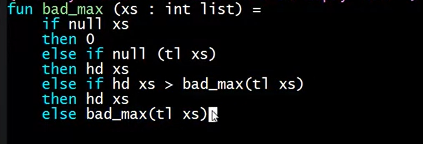
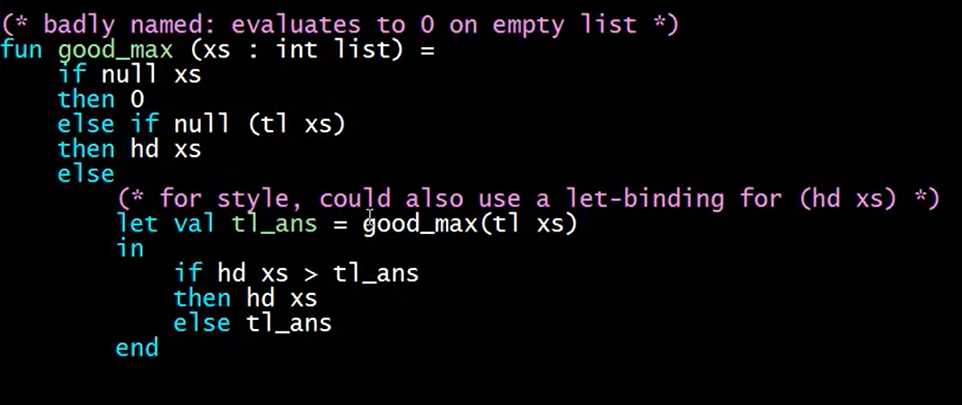
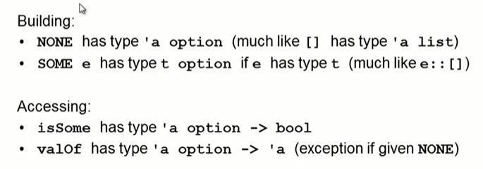
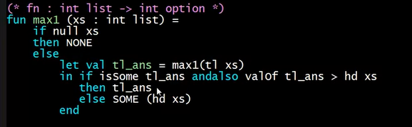
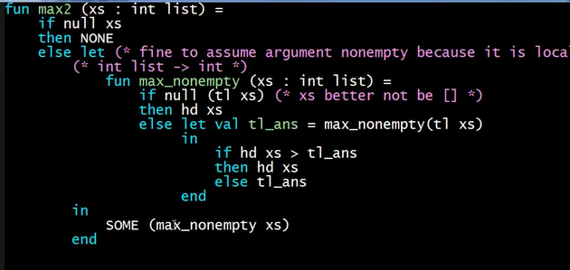
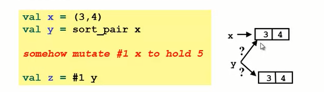
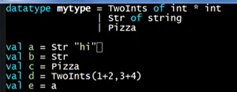
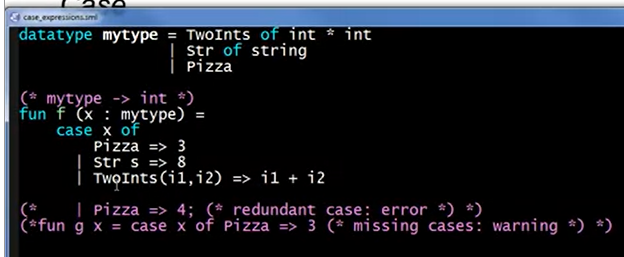

# SCIP课程笔记

## W2

### 程序的本质

1. Syntax: a sequence of digits表达式的语法
2. Type-checking: type int in any static environment运行前val类型的检查
3. Evaluation: to itself in any dynamic environment运行并在动态环境中记录其值

### 表达式的定义

1. 必须是递归的,如同加法是由更小的表达式组成,表达式也是由子表达式定义的。
2. 定义表达式时要注意

   * 该表达式的Syntax语法是否对？
   * Type-checking表达式中的类型以及无法检查类型时如何输出错误提示？
   type-check检查(在使用表达式时进行类型检查),成功->对表达式进行类型检查,没过fail->输出错误提示然后终止。即在静态环境中寻找这个表达式的类型,找到了就输出,没找到就报错。
   * typecheck后在动态环境中寻找表达式的值(此处以val为例)然后使用这个值(这个值是必然存在的因为经过了静态检查,这个表达式必然存在)
   * 例如:val a=10;首先检查val的语法,再检查其类型,a->int,再进行赋值a->10
     * 关于这个binding的问题
       * val的语法？后续是一个值
       * 如何检查a的类型？它这个时候就在静态环境中了吗？在静态环境中,程序会检查binding的值的类型,因为10是一个int,所以在静态环境中a->int
       * 动态环境中什么时候有的10:执行完语句之后动态环境中有a->10,因为binding的时候给了一个10,这个句子经过了语法和type检查后就会把这个值赋给a

3. 例子加法为例
语法:表达式+表达式;子表达式e1和e2typecheck过(成功),且输出其类型是int,则这个加法表达式的typecheck通过并输出int;v1+v2的值(类型检查后其和也是int)
4. 表达式与值的关系:估值(Evaluation)的结果就是值。每个值都是表达式但不是每个表达式都是值【这里是因为不是每个表达式都有估值结果,存在未通过typecheck的表达式,引出一个思考是:词语的语义和逻辑,例如42本身即代表了42这个字,也代表了42这个值】

   * 有一些会自行估值其值的表达式(42 evaluates to 42,true evaluates to true)
   * 每个类型都有其特定的值,当使用某种类型的表达式时,这个表达式估值得到的答案就是这些特定的值
   * 以32为例,语法是一串数字;类型检查它的类型是int;估值(求值规则)是产生其自身。

5. 复杂的例子:if e1 then e2 else e3
   1. Syntax: if e1 then e2 else e3;if,then,else是语法关键词(keywords);e1,e2,e3是子表达式
   2. Type-checking: e1:bool;e2 and e3:t(any type but same)且整个表达式类型是是t
   3. Evaluation: e1->v1(因为经过了类型检查所以v1是true或者false);if true:估值e2并作为整个表达式的结果;if else:估值e3并将v3作为整个表达式的结果。
6. less than
   1. Syntax: e1< e2("<"是一个逻辑运算符)
   2. Type-checking: e1 and e2:t(any type but same:数字型)且整个表达式类型(过了的话)是bool
   3. Evaluation: e1->v1和e2->v2(因为经过了类型检查所以e1和e2必然有v1和v2),如果v1< v2输出true不然flase

### REPL和错误

1. REPL:Read-Eval-Print-Loop 程序本身就是一个REPL,use语句可以更方便的使用它

* 当运行程序的时候(打开rapple输入use)发生读取-估值(如果载估值之前没有类型检查会输出错误信息)-打印结果-循环(返回提示以继续)
* 表达式的开始是以val这类开始的,如果没有键入val就开始下一行,`val x=10;y=x+1`是存在这个类型的语法的,但是可能会解析成`val x = 34 (y=x) +1`此时(y=x)输出一个bool值,而34被认为是一个函数,但是34并不是一个函数,在类型检查中34没有通过其'fun'的类型,因此报错为"operator is not a function [overload conflict]"
* 负数要用~(负号是语法错误);整数除法不能用/要用div(类型检查错误)
  
### Shadowing

1. Shadowing是指将变量添加到环境中时,在添加之前,该变量已在环境中。
2. 例子:val a=5;val a=10;此时a=5这个是无法改变的,我们获得是是一个遮罩值10,此时的a->10,当使用val a=a+1;此时a->11遮住了之前的10。在输出的时候,5和10的语句都会被显示为hidden-value,只有最后的a有值

   ```sml
   val a = < hidden-value > : int
   val b = 9 : int
   val a = < hidden-value > : int
   val a = 6 : int
   val it = () : unit)

   ```

3. 最好不要重复赋值,因为动态环境的值除非重启不然一直存在

### function

1. 语法:fun fun_name(arguments:int,y:int)=
            ...expression...
2. 除非只有一个参数不然要加括号,会自动返回得出的结果不用加return。

   * 在输出函数中,`val pow = fn : int * int -> int`里的*不是乘法,它只是分隔多个参数的类型。这里是指两个int输入pow会输出一个int

3. 函数定义的三部曲

   * Syntax:只检查fun的命名
   * Typing Checking:检查输入的参数和输出的参数的类型是否正确以此获得函数的整体类型,然后将函数加入静态环境中(注意A fun is a value(no evaluation)注意函数中的参数名是不会加入静态环境的,就和其他的编程语言一样。
   * Evaluation:把函数名加入动态环境以便后续可以对其进行调用

4. 函数调用的三部曲 e0(e1,...,en)

   * Syntax:首先在动态环境中检查函数名e0以获得函数本体,然后剩下的参数会作为函数的输入参数。参数的语法就是要用逗号分隔。*不检查参数的个数是否正确。
   * Type Checking:检查e0是否有类型(即左边是参数类型右边是函数的输出类型);检查e1,e2...参数的类型是否和e0左边的参数类型一一对应。最后检查fun call的结果的类型是不是e0的类型。
   * Evaluation:实际上有三个步骤。首先,计算e0以确定要调用的函数。查找e0对应的函数,在动态环境(静态环境里面是函数的类型,*int*int->int)中找到函数的正确绑定。然后计算所有的参数对应的值,最后计算函数fun body来输出最后的值(最后的结果的类型检查在上一步已经做了)

### Pairs and Other Tuples——smaller pieces of data

1. 整合数据的类型——tuples:数目固定,数据类型可以不同;list:数目不定,数据类型相同
2. pairs:包含两个部分

* bulid pairs
  * syntax:(e1,e2)两个逗号分隔的表达式
  * typing checking:e1->ta,e2->tb,(e1,e2)->(ta*tb)星号是分隔符
  * evaluation:e1->value1,e2->v2,(v1,v2)->value
* access the pieces of pairs:
  * syntax: #1e,#2e代表访问求出的e的第一个第二个部分
  * typing checking:(e1,e2)->(type a*type b)则e1->ta,e2->tb,
  * evaluation:返回syntax对应的值
* pairs=two tuples,创建n元tuples=(e1,e2,e3...en),tuples可以嵌套进任何数据结构中
  * val x=(7,(ture,9))->int*(bool*int);val x2=#1 (#2 x1)->bool

### List

1. 不同于元组,list可以指定数目,但是需要类型相同
2. value:空list[]这本身就是一个值,因此求值规则很简单,就是其自身。一个列表也是一个value,这意味着我们可以将列表作为value绑定到variable上(val x=[3,4])
3. list的构建方法

   * 定义法:val x=[1,2,3]->int list
   * CONS方法:e1::e2(e1:value,e2:list) 即 5::x->[5,1,2,3]->int list
     * [5]:: [1,2]不行,因为int list不能容纳int list
     * [5]:: [[6],[7]]->[[5],[6],[7]]->int list list
     * 类型检查:e1::e2(e1->t,e2->t list)

4. list的调用方法

   * null e->e==[](null这是一个函数,它将列表作为参数,如果列表为空则返回true,否则返回false)
   * hd e和tl e返回列表的第一个元素和除第一个元素以外的所有元素
   * val x=[9];tl x->[]:`a list(一个元素的list的tl会返回空list,同时如果我对空列表使用hd,虽然可以通过类型检查但是会报错)

5. 列表的类型

   * [(1,2),(3,4)]->(int*int) list
   * [([1,2],2),([1,2],4)]->(int list*int) list

6. 空列表的类型

   * val x=[]->`a list:这个alpha(‘a)意味着可以用任何类型替代他

7. 创建和使用列表的函数类型

   * null:'a list->bool
   * hd:'a list->'a
   * tl:'a list->'a list

8. 利用递归可以实现很多list的操作,例如乘法和求和等等

### Let Expressions

在函数内部定义变量

1. 三问题

   * syntax:let b1,b2...bn in e end(b1,b2...是绑定,就类似val a;e是let表达式的主体)
   * typing checking:检查b的类型然后加入【内部】静态环境中,主体e的结果将是整个let表达式的结果。这些绑定对任何环境都没有影响,除了在这个let表达式中。将允许在检查主体的类型时使用所有这些绑定,然后主体e的类型将是整个let表达式的类型。在let中可以使用此前环境【外环境】中所有的绑定。
   * evaluation:根据let-in之间的绑定值计算整个in-end之间的e的值

2. let-in-end可以用在任何可以插入表达式的地方

   * 注意,在let中如果有shadow(覆盖)外部值,这个shadow的值是只保留在当前let的内部环境中的。let中的绑定和计算只影响它内部环境中的绑定,并返回整个e的值
   * 此前只能使用在整个程序的顶端绑定的值,在let中又可以拥有let中绑定的值,且只在当前let中使用它。

3. let与内部函数(local function局部函数=nested function嵌套函数)

   * let-in中间可以放入函数的定义,因为函数也是一个绑定,在这里定义的函数可以在in-end部分使用,这就是利用let在函数内部建立的函数。这可以使得在let-in中定义的函数是private的。
   * let-in中可以使用let之前的变量,这个变量在let之前就存在环境中,因此在let内部可以调用这个外部环境中的绑定
   * f2中定义的f1函数的scope:只能在let表达式的后续绑定和let表达式的主体(“in”部分)中使用局部函数。
   * 注意嵌套函数的使用范围,以及是否适用。

### Let Efficiency

1. 递归法求极值在列表很大时,会消耗很长的时间,这是因为它要遍历每一个列表的值。
已知当极大值在列表尾端会消耗很久的时间,这是因为在这个计算中,会计算每个列表两次,即30个元素的列表会递归计算两次,29的也会,一直到遍历到最后的最大值,由于每一个递归内部都有两次递归计算,因此最后的计算次数实际上是2^n

因此在函数中应当避免重复调用递归,即将结果存储在变量中

2. 代码高效:避免重复计算的递归,这会造成指数级别的算术成本。使用let表达式可以在函数中定义新的函数,解决递归问题。

### Options

option就如同list一样,也是一个类型。建立option的方法类似list。

1. 定义和调用

这里的SOME就类似建立一个仅有一个元素的列表。
`val t = SOME 3 : int option`
`val y = NONE : 'a option`
isSome类似判断列表是否为空,不过这里的情况是如果option为SOME(非空)就返回true。
`val it = true : bool`
valOf如果输入的是NONE会返回异常,否则返回值
`valOf t;->val it = 3 : int`

2. max_option版本

但是let中,`isSome tl_ans`是一个重复的判断,因为只有在进行到列表的最后的时候,tl返回的才是空列表,此时的tl_ans才会是NONE,即这个判断大多数时候做出的都是SOME,并且在最后一次为NONE的时候会将这个结果层层返回 递归中。即在空列表上会进行递归调用(假设此时递归进行到尾端,此时的max1(tl xs)是max1(NONE),这就导致空的列表还会进行一次递归,这可能会引发异常)

max2只用非空的xs来进行递归调用,避免了空列表递归

3. option与list差异
定义类似,判定函数不同,且option仅有NONE或仅包含一个元素的SOME

### Booleans and Comparison Operations

1. Booleans Operations`e1 andalso e2`和`e1 orelse e2`和`not e1`
Type-checking:e1:bool,e2:bool
Evaluation:与运算,或运算,否运算
【注意】andalso和orelse只是关键字而不是函数,not是函数,因为在调用函数前就会对函数进行评估。而andalso和orelse并不会,当仅仅输入andalso和orelse时会报错,需要关键词,而输入not,会报告其函数类型
2. Comparison Operations=六个比较符号`< > >= <= = <>`
`< > >= <=`可以用于int *int或real* real(real就是float)但是不可以用于int * real
`= <>`不可以用于real,浮点数总是有微小的不同,<>是反等号(!=)

### Benefits of No Mutation

关于原地修改:函数式编程的特点是无法原地修改


* 如果y和x指向的同一个pair,那么y称为x的别名aliases
* y指向另一个pair,不是x的别名
* 那么对x做出修改后,y是别名还是copy决定了y是否有变化
在ML中,没有mutation,因此同变量都是别名,不是复制值只是返回了值的别名。在有突变的语言中分辨别名和copy是很难的,ML避免了这一点(不会因为改变了其中一个别名的值导致所有的别名都变化,因为不能mutation)。

### Pieces of a Language


1. 语法:语言的结构,使用的语法结构
2. 语义:评估(计算值)的规则,程序的意义
3. Idioms:编程习惯用法是用特定语言编写任务的常用方法,知道语法更要知道用法,比如let-in的idiom use就是使之是内部的
4. Libraries:库,可以自己定义也可以调用
5. Tool:语言的工具,而非语言的一部分,例如REPL,debug

Focus on semantics and idioms.

## W3

### Building Compound Types

1. Base type and Compound type
   * base:int,bool...
   * compound:build new types with other types inside of them=list,tuple...
2. Build Compound fun
   * each of(包含t1,t2,t3,比如物体的位置(int\*int\*int)),one of(包含t1,t2,t3的某个值,例如某个饼干的味道,某一天的天气),self reference(递归调用)
   * each of:tuple(int*bool)包含“所有”的值
   * one of:option(要么SOME要么NONE)
   * list:三者都有,list可以是包含int和一个int list(这是自我调用的全包含),也可以什么都没有(这是仅包含其一)
   * 一个例子:((int \* int) option \* (int list list)) option,其中(int list list)can be described in terms of each of, one of and self reference.

### Records——build each of type(another one called tuple)

1. field name:该类型中包含的field的名字,field则对应某个表达值,定义时无需声明field类型,会自动根据表达式计算
2. record的输出会计算每个表达式的结果并返回一个按字母排序后的record,且整个record的类型由{}包裹并显示每个field的类型
3. exp:`val X = {idx=1,name="adam"};`,输出`val X = {idx=1,name="adam"} : {idx:int, name:string}`
4. 调用:`#idx X`
5. 与tuple的区别:tuple短且由定位,record便于分辨和记忆。但在有的编程语言中会混用,比如调用者caller用position调用而被调用者用name调用
   * Tuple as syntactic sugar
   * tuple是record的另一种表达形式,当filed name是连续的int时,record表现为tuple(Tuple's just another way of writing the record with field names one up to n)
   * exp:`val x = {1=1,2="aaa",3=true};`->`val x = (1,"aaa",true) : int * string * bool`

### Datatype Bindings

val binding,fun binding,data type binding

1. datatype绑定的每一个类型相当于一个函数,会将对应的类型转为datatype指定的类型名字
2. 在下列例子中,`val a = Str "hi"`代表着a具有mytype的Str种类(即“tag”,表示构造a的constructors种类),其str值为"hi"(对应的值),整个a的值是:应用于"hi"的mytype中的Str构造函数的返回值,这种包含构造函数的表现形式也成为"tagged unions"-标记联合

3. 构造mytype中的kind时就是made from one of the constructors,其实就是一个小的构造函数
4. Pizza->value,`val a = Pizza : mytype`就类似于`val b = [] : 'a list`都是一个值,不过这个值代表着空值。
5. 关于类型的访问
   * 需要两个方面来访问数据:check variant=检查数据的tag,即其construct;extract data=提取数据的值
   * 例如:check variant->null/isSome;extract data=hd/tl/valOf
6. 关于datatype的辨析
   * datatype的值包含其构造函数及其值
7. list和option也是datatype，NONE/SOME也可以作为case中的pattern，[]和::也可以作为case中的pattern.利用这个可以构建option和list相关的函数

```sml

fun inc_or_zero intoption =
    case intoption of
      NONE => 0
      | SOME i => i+1

fun sum_list xs =
    case xs of
      [] => 0
      | x::xs' => x + sum_list xs'

fun append (xs,ys) =
    case xs of
      [] => ys
      | x::xs' => x :: append(xs',ys)
<!-- append的分支顺序可以交换，因为case不是顺序执行而是择一执行 -->
```
case表达式可以有效避免list为空或者option为空产生的错误，应当多用case而非isSome...
### Case Expressions

使用 case 表达式来访问数据类型的各个部分`case x of...`对case的每种不同情况(即mytype中的不同类型)之间用"|"分隔,如果mytype的构造函数具有返回值,需要指定该值的绑定变量名,例如`Str S`就是保存了x是一个str情况下的string值


1. case of
   * 匹配的是箭头左边的pattern,检查哪个分支匹配,这个匹配是从一个构造函数建造的
   * 每个分支都相当于一个小的let,let的val就是这些构造函数名字后面的变量名,比如let TwoInt传入的第一个int作为i1,let s为Str的传入值(这里的str相当于str("hi"),str就是一个构造函数,"hi"是传入的值,也是用s指代的值)
   * case of的数据类型就是每个分支的数据类型

2. 匹配的过程pattern match
   * 首先,找到匹配的分支并适当地绑定变量
   * 然后在该分支环境中,评估右侧的表达式
   * 分支中绑定的变量的使用`Str s => String.size s`或`i1+i2`

3. case of的一般表达式

   ```sml
   case e0 of
        p1 ==> e1
        p2 ==> e2
        ...
        pn ==> en
   ```

   * pattern是一个类型,TwoInts(i1,i2)看上去很像一个表达式,但是不是,pattern包括的是constructor名及其变量
   * pattern不会进行评估evaluate,只会在e0匹配了某个pattern后计算其右边的e

4. case of需要注意的
   * case of的分支不可重复,即不能出现两个Str分支(match redundant)
   * case of的分支也不可缺少,不然在调用没有定义分支的pattern时会报错match non exhaustive
   * 不可错分支取值,即在Str分支下试图取TwoInt的int值
   * 非常优雅,比用函数检查类型构造优雅得多

### Useful Datatypes

1. datatype的应用：枚举enumerate(例如纸牌中花色作为suit datatype的pattern),识别identifying

   * 例如在辨识学生成绩时，要么取得学生的ID，要么取得学生的名字。如果选择将学生的成绩，姓，名字和中间名都列入record将是一个糟糕的方式，这是一个each of type，但是我们并不是需要使用全部的值，而只是需要一部分，即one of type。当需要所有的数据，即学生名字和学号时，each of type是一个合理的方式

2. 递归的datatype(注意datatype中construct的名字不代表函数，那只是一个类别的名字。真正的构造函数在调用这个类型的case里面的箭头处)
   * exp的一个例子，相当于一个set tree

   ```sml
   datatype exp = Constant of int 
             | Negate of exp 
             | Add of exp * exp
             | Multiply of exp * exp

   fun eval e =
    case e of
        Constant i => i
      | Negate e2  => ~ (eval e2)
      | Add(e1,e2) => (eval e1) + (eval e2)
      | Multiply(e1,e2) => (eval e1) * (eval e2)

   fun number_of_adds e =
     case e of
        Constant i      => 0
      | Negate e2       => number_of_adds e2
      | Add(e1,e2)      => 1 + number_of_adds e1 + number_of_adds e2
      | Multiply(e1,e2) => number_of_adds e1 + number_of_adds e2

   fun max_constant e =
      let fun max_of_two (e1,e2) =
         let val m1 = max_constant e1
             val m2 = max_constant e2
         in 
            if m1 > m2 then m1 else m2 
         end
      in
         case e of
         Constant i      => i
         | Negate e2       => max_constant e2
         | Add(e1,e2)      => max_of_two(e1,e2)
         | Multiply(e1,e2) => max_of_two(e1,e2)
      end

   fun max_constant2 e =
      case e of
      Constant i      => i
      | Negate e2       => max_constant2 e2
      | Add(e1,e2)      => Int.max(max_constant2 e1, max_constant2 e2)
      | Multiply(e1,e2) => Int.max(max_constant2 e1, max_constant2 e2)

   val example_exp = Add (Constant 19, Negate (Constant 4))

   val example_ans = eval example_exp

   val example_addcount = number_of_adds (Multiply(example_exp,example_exp))
   ```

   * number_of_adds不计算值，是计算在运算中发生多少次加法。
   * 数据类型对于表示许多不同类型的数据很有用。特别是，这些有趣的树状结构，我们可以在上面编写递归函数，以产生答案。
   * 关于`Negate e2       => number_of_adds e2`中e2的作用，是用来存储传入的值，以便pattern对应的表达式进行调用
   * 如果模式匹配的构造函数不包括数据，就类似匹配到一个空的datatype中的construct，因此，在这种情况下，如果它匹配，则没有什么新东西可以添加到环境中，但仍然会转到相应的分支执行评估该表达式
   * max_constant2是为了避免在let中反复计算递归值，而是将递归放置尾部

### Type Synonyms

`type anme = t`Type只是为已经存在的相同类型创建另一个名称，一般不用type去定义数据类型，而是用type对数据类型或者已有的数据类型的组合进行重命名，然后在任何用到这个类型的地方使用type的名字，type的名字和type指向的类型t是可以互换的

```sml
datatype suit = Club | Diamond | Heart | Spade

datatype rank = Jack | Queen | King | Ace | Num of int

type card = suit * rank

type name_record = { student_num : int option, 
                     first       : string, 
                     middle      : string option, 
                     last        : string }

fun is_Queen_of_Spades (c : card) = 
    #1 c = Spade andalso #2 c = Queen

val c1 : card = (Diamond,Ace)
val c2 : suit * rank = (Heart,Ace)
val c3 = (Spade,Ace)
<!-- 这三种定义方式都是合理的，其类型都是card，在输出的时候可能显示的不同，即card或者suit * rank，但是本质是一样的 -->
```
